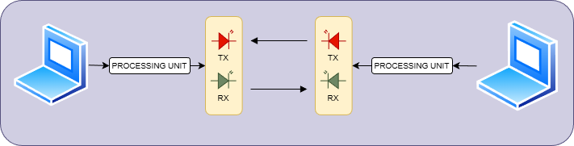

# 💡 Li-Fi File Sharing — UART Receiver with SSD1306 OLED Display

> **ATmega328P (Arduino Uno) | AVR Assembly | 300 Baud | I2C OLED 128×32**

This project implements a **Li-Fi (Light Fidelity) optical receiver** in pure AVR assembly. Data transmitted via light (LED/photodiode) is received over UART at 300 baud and displayed in real-time on an SSD1306 OLED screen over I2C.



---

## 📑 Table of Contents

- [Project Overview](#-project-overview)
- [Part 1 — System Architecture, Configuration \& USART Communication](#-part-1--system-architecture-configuration--usart-communication)
- [Part 2 — I2C/TWI Communication \& SSD1306 OLED Display Driver](#-part-2--i2ctwi-communication--ssd1306-oled-display-driver)
- [Part 3 — Font Rendering, Display Logic \& Data Section](#-part-3--font-rendering-display-logic--data-section)
- [Complete Program Flow](#-complete-program-flow)
- [Key Concepts Summary](#-key-concepts-summary)
- [Register Usage Reference](#-register-usage-reference)

---

## 🔭 Project Overview

| Detail | Value |
|--------|-------|
| **MCU** | ATmega328P (Arduino Uno) |
| **Language** | AVR Assembly (Motorola 68K-style syntax) |
| **Serial** | UART — 300 Baud, 8N1 (RX only) |
| **Display** | SSD1306 OLED 128×32, I2C @ 100 kHz, Address `0x3C` |
| **Application** | Receive text data via Li-Fi optical link and display on OLED |

### What is Li-Fi?

Light Fidelity (Li-Fi) uses **visible light** (LEDs and photodiodes) to transmit data wirelessly. In this project, the UART TX line on the transmitter side drives an LED, and a photodiode feeds the received signal into the UART RX on this receiver. The **300 baud** rate is chosen because simple optical components have limited bandwidth.

### How It Works

1. A Li-Fi transmitter sends data optically (LED blinks)
2. A photodiode converts light pulses to electrical signals
3. The ATmega328P's UART receives the serial data at 300 baud
4. Each received character is stored in an SRAM buffer
5. The entire message buffer is rendered on the OLED after every new character
6. A newline (`\n` or `\r`) clears the display and resets the buffer

---

## 🧑‍💻 Part 1 — System Architecture, Configuration & USART Communication

### 1.1 Include File

```asm
.include "m328pdef.inc"
```

This is a **register and bit-name definition file** provided by Microchip/Atmel. It maps symbolic names (like `UCSR0A`, `TWCR`, `RAMEND`, `SPH`, `SPL`) to their actual memory-mapped I/O addresses on the ATmega328P. Without it, you'd need to use raw hexadecimal addresses.

---

### 1.2 Constants

```asm
.equ F_CPU       = 16000000
.equ BAUD        = 300
.equ UBRR_VAL    = (F_CPU / (16 * BAUD)) - 1   ; = 3332 = 0x0D04
```

#### Baud Rate Calculation

The ATmega328P datasheet defines (for normal asynchronous mode):

```
UBRR = (F_CPU / (16 × BAUD)) - 1
     = (16,000,000 / (16 × 300)) - 1
     = (16,000,000 / 4,800) - 1
     = 3332 (0x0D04)
```

- This is a **16-bit value**, split across `UBRR0H` (high byte `0x0D`) and `UBRR0L` (low byte `0x04`).
- UBRR is USART Baud Rate Register
- **Why 300 baud?** Li-Fi with simple LED/photodiode circuits has limited bandwidth. 300 bits/second is slow but reliable for basic optical transmission.

#### 8N1 Frame Format

- **8** data bits per frame
- **N** = No parity bit
- **1** stop bit

---

### 1.3 Interrupt Vector Table

```asm
.org 0x0000
    rjmp RESET

.org 0x0034
RESET:
```

- **`.org 0x0000`** places the instruction at address `0x0000` in program memory — the **reset vector**. When the MCU powers on or resets, execution starts here.
- **`rjmp RESET`** — **Relative Jump**: an unconditional jump using a signed 12-bit offset (range: ±2K words).
- **`.org 0x0034`** — The ATmega328P has **26 interrupt vectors** (each 2 words = 4 bytes), occupying addresses `0x0000` to `0x0033`. Main code is placed at `0x0034` to avoid collisions with the vector table.

---

### 1.4 Stack Pointer Initialization

```asm
ldi   r16, high(RAMEND)
out   SPH, r16
ldi   r16, low(RAMEND)
out   SPL, r16
```

The stack is used by `rcall`/`ret` (to save/restore return addresses) and by `push`/`pop`. On ATmega328P, `RAMEND = 0x08FF` (2KB SRAM). The stack **grows downward** from RAMEND.

**Key Instructions:**

| Instruction | Meaning |
|-------------|---------|
| `ldi Rd, K` | **Load Immediate** — loads constant `K` into register `Rd` (r16–r31 only) |
| `out addr, Rr` | Write to I/O space (addresses 0x00–0x3F). SPH/SPL are in this range |
| `sts addr, Rr` | Write to extended I/O / SRAM space (addresses > 0x3F). USART and TWI registers use this |

---

### 1.5 USART Initialization

```asm
USART_INIT:
    ldi   r16, high(UBRR_VAL)
    sts   UBRR0H, r16
    ldi   r16, low(UBRR_VAL)
    sts   UBRR0L, r16

    ; Enable receiver only
    ldi   r16, (1 << RXEN0)
    sts   UCSR0B, r16

    ; 8N1 frame format
    ldi   r16, (1 << UCSZ01) | (1 << UCSZ00)
    sts   UCSR0C, r16
    ret
```

- **Why only `RXEN0`?** This is the **receiver side** of the Li-Fi link. It only receives data, never transmits. Enabling only `RXEN0` saves power.
- **`UCSZ01` + `UCSZ00`** set the character size to **8 bits**:

| UCSZ02 | UCSZ01 | UCSZ00 | Size |
|--------|--------|--------|------|
| 0 | 0 | 0 | 5-bit |
| 0 | 1 | 1 | **8-bit** ✓ |
| 1 | 1 | 1 | 9-bit |

---

### 1.6 Main Loop — UART Polling

```asm
MAIN_LOOP:
    lds   r16, UCSR0A
    sbrs  r16, RXC0
    rjmp  MAIN_LOOP
    lds   r16, UDR0
```

**How UART polling works:**

1. Read `UCSR0A` (USART Control and Status Register A)
2. Check if bit `RXC0` (Receive Complete flag) is set
3. If not → loop (no data yet)
4. If set → read `UDR0` (USART Data Register) to get the received byte

**Key Instruction — `sbrs`:**
`sbrs Rr, b` — **Skip if Bit in Register is Set**. If bit `b` of register `Rr` is 1, it skips the next instruction. So if `RXC0` is set, the `rjmp MAIN_LOOP` is skipped and execution falls through to read the data.

**Why polling instead of interrupts?** At 300 baud, a character takes ~33ms. The MCU at 16MHz has plenty of idle time between characters. Polling is simpler and sufficient for this data rate.

---

### 1.7 Character Handling

```asm
    cpi   r16, 0x0A            ; '\n'
    breq  CLEAR_MSG
    cpi   r16, 0x0D            ; '\r'
    breq  CLEAR_MSG

    mov   r17, r2
    cpi   r17, MAX_CHARS       ; Buffer full? (21 chars)
    brsh  MAIN_LOOP
```

| Instruction | Meaning |
|-------------|---------|
| `cpi Rd, K` | **Compare with Immediate** — subtracts K from Rd without storing, only sets flags |
| `breq label` | **Branch if Equal** — jumps if Zero flag is set |
| `brsh label` | **Branch if Same or Higher** (unsigned ≥) — jumps if Carry flag is clear |

- `0x0A` = Line Feed (`\n`), `0x0D` = Carriage Return (`\r`) — both clear the display
- **`r2`** is used as a persistent message length counter (low register, never clobbered by subroutines)

---

### 1.8 SRAM Buffer Usage

```asm
.equ MSG_BUF     = 0x0100      ; Start of SRAM
.equ MSG_BUF_END = 0x0115      ; 21 chars max

    ldi   XL, low(MSG_BUF)
    ldi   XH, high(MSG_BUF)
    add   XL, r2
    clr   r17
    adc   XH, r17
    st    X, r16
    inc   r2
```

- **X register** = 16-bit pointer composed of `r27` (XL) and `r26` (XH). AVR has three pointer pairs: X (r27:r26), Y (r29:r28), Z (r31:r30).
- **Why `0x0100`?** On ATmega328P, general-purpose SRAM starts at `0x0100` (addresses 0x0000–0x00FF are registers and I/O space).
- **16-bit addition**: `add` adds the low bytes, `adc` (add with carry) propagates the carry to the high byte.
- **`st X, r16`** — **Store Indirect**: writes the register value to the SRAM address pointed to by X.

---

## 🖥️ Part 2 — I2C/TWI Communication & SSD1306 OLED Display Driver

### 2.1 I2C/TWI Protocol Overview

**I²C** (Inter-Integrated Circuit) is a **2-wire serial protocol**:

| Line | Purpose |
|------|---------|
| **SDA** | Serial Data — bidirectional |
| **SCL** | Serial Clock — driven by master |

Atmel calls it **TWI** (Two-Wire Interface) for trademark reasons, but the protocol is identical. It supports multiple devices on the same bus, each with a unique 7-bit address.

**SSD1306 Address:**
- 7-bit address: `0x3C` (60 decimal)
- Write mode: `(0x3C << 1) | 0` = `0x78`
- Read mode: `(0x3C << 1) | 1` = `0x79`

---

### 2.2 TWI Initialization

```asm
TWI_INIT:
    ldi   r16, TWBR_VAL       ; = 72
    sts   TWBR, r16
    ldi   r16, 0x00            ; Prescaler = 1
    sts   TWSR, r16
    ret
```

**I2C Clock Frequency Formula:**

```
f_SCL = F_CPU / (16 + 2 × TWBR × 4^TWPS)

With TWPS = 0 (prescaler = 1):
TWBR = (F_CPU / f_SCL - 16) / 2
     = (16,000,000 / 100,000 - 16) / 2
     = (160 - 16) / 2
     = 72
```

This produces a standard **100 kHz** I2C clock.

---

### 2.3 TWI Start Condition

```asm
TWI_START:
    ldi   r16, (1 << TWINT) | (1 << TWSTA) | (1 << TWEN)
    sts   TWCR, r16
TWI_START_WAIT:
    lds   r16, TWCR
    sbrs  r16, TWINT
    rjmp  TWI_START_WAIT
    ret
```

**TWCR (TWI Control Register) Bits:**

| Bit | Name | Purpose |
|-----|------|---------|
| `TWINT` | TWI Interrupt Flag | **Write 1 to clear** and start the operation |
| `TWSTA` | TWI Start | Generate a START condition |
| `TWEN` | TWI Enable | Enables TWI hardware |

**Electrically:** A START condition is when SDA transitions **HIGH → LOW** while SCL is **HIGH**. This is a special condition that all I2C devices recognize as the beginning of a transaction.

The code **busy-waits** by polling `TWINT` until the hardware finishes generating the START condition.

---

### 2.4 TWI Write (Send Byte)

```asm
TWI_WRITE:
    sts   TWDR, r16
    ldi   r16, (1 << TWINT) | (1 << TWEN)
    sts   TWCR, r16
TWI_WRITE_WAIT:
    lds   r16, TWCR
    sbrs  r16, TWINT
    rjmp  TWI_WRITE_WAIT
    ret
```

**Step-by-step:**

1. Place byte in `TWDR` (TWI Data Register)
2. Clear `TWINT` and enable TWI → triggers transmission
3. Hardware shifts out 8 bits on SDA, clocked by SCL
4. Slave sends ACK (pulls SDA low on 9th clock)
5. `TWINT` is set → code exits the wait loop

**Why `r16` is reused:** The byte is already safely in the hardware `TWDR` register before `r16` is overwritten with the control value.

---

### 2.5 TWI Stop Condition

```asm
TWI_STOP:
    ldi   r16, (1 << TWINT) | (1 << TWSTO) | (1 << TWEN)
    sts   TWCR, r16
    ret
```

- **No wait loop needed** — the `TWSTO` bit is **automatically cleared by hardware** once the STOP condition completes.
- **Electrically:** SDA transitions **LOW → HIGH** while SCL is **HIGH**. This releases the bus.

---

### 2.6 SSD1306 Command Sending

```asm
SSD1306_CMD_SEND:
    push  r16                           ; Save command byte
    rcall TWI_START
    ldi   r16, (SSD1306_ADDR << 1) | 0 ; Address + Write (0x78)
    rcall TWI_WRITE
    ldi   r16, SSD1306_CMD              ; Control byte: 0x00 = command mode
    rcall TWI_WRITE
    pop   r16                           ; Restore command byte
    rcall TWI_WRITE                     ; Send the actual command
    rcall TWI_STOP
    ret
```

**I2C Transaction Structure:**

```
START → [0x78 addr+W] → [0x00 cmd mode] → [command byte] → STOP
```

**SSD1306 Control Bytes:**

| Byte | Mode | Meaning |
|------|------|---------|
| `0x00` | Command | Following bytes are display commands |
| `0x40` | Data | Following bytes write to GDDRAM (pixel data) |

**`push`/`pop`:** The command byte in `r16` is saved to the stack before `r16` is reused for the address and control bytes, then restored before sending.

---

### 2.7 SSD1306 Initialization Sequence

The full init configures the display for 128×32 operation:

| Command | Hex | Purpose |
|---------|-----|---------|
| Display OFF | `0xAE` | Turn off during setup |
| Clock Divider | `0xD5, 0x80` | Default oscillator frequency |
| Multiplex Ratio | `0xA8, 0x1F` | 32 rows − 1 = 31 for 128×32 |
| Display Offset | `0xD3, 0x00` | No vertical shift |
| Start Line | `0x40` | RAM row 0 → COM0 |
| Charge Pump | `0x8D, 0x14` | **Enable internal DC-DC converter** (generates ~7.5V for OLED) |
| Memory Mode | `0x20, 0x00` | **Horizontal addressing** — auto-increments column, wraps to next page |
| Segment Remap | `0xA1` | Mirror horizontally |
| COM Scan Dir | `0xC8` | Flip vertically |
| COM Pins | `0xDA, 0x02` | Sequential config for 128×32 |
| Contrast | `0x81, 0x8F` | Medium-high brightness |
| Pre-charge | `0xD9, 0xF1` | Phase timing for pixel charging |
| VCOMH Level | `0xDB, 0x40` | Deselect voltage ≈ 0.77 × VCC |
| Display ON (RAM) | `0xA4` | Output follows RAM content |
| Normal Mode | `0xA6` | Not inverted (1 = pixel ON) |
| Display ON | `0xAF` | Turn display on |

**Why is the charge pump needed?** OLED pixels require a higher voltage (~7.5V) than the 3.3V/5V supply. The built-in charge pump is a DC-DC converter that generates this voltage internally.

**What is horizontal addressing mode?** After writing a byte, the column pointer auto-increments. At the end column, it wraps to column 0 of the next page. This allows streaming all pixel data sequentially without manual cursor updates.

---

### 2.8 Display Clear

```asm
SSD1306_CLEAR:
    ; Set column 0–127, page 0–3
    ; Then send 512 bytes of 0x00

    ldi   r18, 2               ; Outer loop: 2 iterations
CLEAR_OUTER:
    ldi   r17, 0               ; Inner loop: 256 iterations (0 wraps)
CLEAR_INNER:
    ldi   r16, 0x00
    rcall TWI_WRITE
    dec   r17
    brne  CLEAR_INNER
    dec   r18
    brne  CLEAR_OUTER
```

**Why 512 bytes?**
- 128 columns × 4 pages = **512 bytes** in GDDRAM
- Each byte = vertical 8-pixel column within a page
- 32 rows ÷ 8 bits/page = 4 pages

**Loop trick:** `r17` starts at 0. `dec` makes it 255, counts down to 0 → exactly **256 iterations**. Outer loop × 2 = 512 total.

---

### 2.9 Cursor Positioning

```asm
SSD1306_SET_CURSOR_HOME:
    ; Column: 0 to 127
    ; Page: 1 to 3 (skips page 0)
```

**What are SSD1306 pages?**

| Page | Pixel Rows |
|------|-----------|
| 0 | Rows 0–7 *(skipped — damaged)* |
| 1 | Rows 8–15 ✓ |
| 2 | Rows 16–23 ✓ |
| 3 | Rows 24–31 ✓ |

Starting at **page 1** is a hardware workaround — the first 8 pixel rows on this particular OLED module are damaged/unreliable.

---

### 2.10 Flash String Printing

```asm
SSD1306_PRINT_FLASH_STRING:
PRINT_FLASH_LOOP:
    lpm   r16, Z+              ; Load byte from Flash, post-increment Z
    cpi   r16, 0               ; Null terminator?
    breq  PRINT_FLASH_DONE
    rcall SSD1306_SEND_CHAR_GLYPH
    rjmp  PRINT_FLASH_LOOP
```

- **`lpm Rd, Z+`** — **Load Program Memory**: reads a byte from **Flash** at the address in Z, then post-increments Z. Strings and font data live in Flash (program memory), not SRAM.
- **Why `2 * STR_WAITING`?** AVR Flash is **word-addressed** (16-bit), but `lpm` uses **byte addresses**. Multiplying by 2 converts word → byte address.

---

## 🎨 Part 3 — Font Rendering, Display Logic & Data Section

### 3.1 Display Message Routine

```asm
DISPLAY_MESSAGE:
    push  r16
    push  r17
    push  r18

    rcall SSD1306_CLEAR
    rcall SSD1306_SET_CURSOR_HOME

    ; Open single I2C data stream for ALL characters
    rcall TWI_START
    ldi   r16, (SSD1306_ADDR << 1) | 0
    rcall TWI_WRITE
    ldi   r16, SSD1306_DATA
    rcall TWI_WRITE

    clr   r18                  ; Character index = 0
DISP_CHAR_LOOP:
    cp    r18, r2              ; index >= msg length?
    brge  DISP_CHAR_DONE
    ; Load char from SRAM → send glyph
    ...
    inc   r18
    rjmp  DISP_CHAR_LOOP

DISP_CHAR_DONE:
    rcall TWI_STOP
    pop   r18
    pop   r17
    pop   r16
    ret
```

**Key Points:**

- **`push`/`pop`** — callee-save convention. Registers are saved on entry and restored on exit so the caller's values aren't corrupted.
- **`cp r18, r2` / `brge`** — `cp` = Compare (subtracts, sets flags), `brge` = Branch if Greater or Equal (signed).
- **Single I2C transaction** for all characters is much more efficient than opening/closing for each character, as each START/STOP has overhead (address byte + control byte).

---

### 3.2 Character Glyph Rendering

```asm
SSD1306_SEND_CHAR_GLYPH:
    ; Clamp to printable range
    cpi   r16, 32
    brlo  GLYPH_DEFAULT        ; < 32 → replace with space
    cpi   r16, 127
    brlo  GLYPH_OK             ; < 127 → valid
GLYPH_DEFAULT:
    ldi   r16, 32              ; Default to space
GLYPH_OK:
    subi  r16, 32              ; Convert ASCII → 0-based index

    ; Calculate Flash address: base + (index × 6)
    ldi   ZL, low(2 * FONT_5x7)
    ldi   ZH, high(2 * FONT_5x7)

    ldi   r17, 6
    mul   r16, r17             ; r1:r0 = index × 6 (hardware multiply)

    add   ZL, r0
    adc   ZH, r1

    ; Send 6 font bytes
    ldi   r18, 6
GLYPH_LOOP:
    lpm   r16, Z+
    rcall TWI_WRITE
    dec   r18
    brne  GLYPH_LOOP
    ret
```

**Font Lookup Process:**

1. **Validate** — ASCII outside 32–126 is replaced with space
2. **Index** — subtract 32 for 0-based offset (space=0, '!'=1, 'A'=33, etc.)
3. **Address** — `FONT_5x7_base + (index × 6)` gives the glyph address in Flash
4. **Send** — transmit 6 bytes (5 glyph + 1 spacer) via I2C

**Key Instructions:**

| Instruction | Meaning |
|-------------|---------|
| `subi Rd, K` | **Subtract Immediate**: `Rd = Rd − K` |
| `mul Rd, Rr` | **Unsigned Multiply**: 8×8 → 16-bit result in `r1:r0` (2 clock cycles, hardware multiplier) |
| `brlo label` | **Branch if Lower** (unsigned <) |
| `brne label` | **Branch if Not Equal** (Zero flag clear) |

---

### 3.3 The 5×7 Font Table

```asm
FONT_5x7:
; Space (32)
.db 0x00, 0x00, 0x00, 0x00, 0x00, 0x00
; ! (33)
.db 0x00, 0x00, 0x5F, 0x00, 0x00, 0x00
; A (65)
.db 0x7E, 0x11, 0x11, 0x11, 0x7E, 0x00
; ...95 characters total (ASCII 32–126)
```

**How the encoding works:**

Each character = **5 vertical columns** of 8 bits. Each byte = one column, bit 0 at top.

**Example — Letter 'A' (`0x7E, 0x11, 0x11, 0x11, 0x7E`):**

```
Bit    Col1   Col2   Col3   Col4   Col5
       0x7E   0x11   0x11   0x11   0x7E
  0     0      1      1      1      0
  1     1      0      0      0      1
  2     1      0      0      0      1
  3     1      0      0      0      1
  4     1      0      0      0      1
  5     1      1      1      1      1
  6     1      0      0      0      1
  7     0      0      0      0      0
```

**Visual rendering (reading rows):**

```
 .###.
#...#
#...#
#...#
#####
#...#
#...#
.....
```

**Why 6 bytes per character instead of 5?**

The 6th byte (`0x00`) serves **two purposes**:
1. **Inter-character gap** — 1 blank pixel between letters
2. **Word alignment** — keeps entries even-aligned in Flash (AVR Flash is 16-bit word-addressed; odd-length entries cause misalignment issues)

**Font statistics:** 95 characters × 6 bytes = **570 bytes** of Flash.

---

### 3.4 String Data

```asm
STR_WAITING:
    .db "Waiting...", 0, 0     ; Pad to even byte count
```

- First `0` = **null terminator** (end of string marker)
- Second `0` = **padding** to make byte count even (AVR `.db` in Flash requires even alignment)
- "Waiting..." = 10 chars + 1 null + 1 pad = **12 bytes** (6 Flash words) ✓

**`.db`** — **Define Byte**: stores raw byte values in **Flash (program memory)**, read at runtime using `lpm`.

---

## 🔄 Complete Program Flow

```
POWER ON / RESET
  │
  ├──→ Set stack pointer (RAMEND = 0x08FF)
  ├──→ Clear message length (r2 = 0)
  ├──→ TWI_INIT       → Configure I2C at 100 kHz
  ├──→ SSD1306_INIT   → Send 26 commands to configure OLED
  ├──→ USART_INIT     → Configure UART: 300 baud, 8N1, RX only
  ├──→ SSD1306_CLEAR  → Clear display
  ├──→ Print "Waiting..." from Flash
  │
  └──→ MAIN_LOOP (infinite polling loop)
        │
        ├── Poll UCSR0A.RXC0 (receive complete flag)
        │   └── Not set → keep polling
        │
        ├── Read byte from UDR0
        │
        ├── Is it '\n' (0x0A) or '\r' (0x0D)?
        │   └── YES → Clear display, reset buffer (r2=0), loop back
        │
        ├── Is buffer full (r2 ≥ 21)?
        │   └── YES → Ignore character, loop back
        │
        ├── Store character at MSG_BUF[r2]
        ├── Increment r2
        │
        ├── DISPLAY_MESSAGE:
        │   ├── Clear entire OLED (512 zero-bytes)
        │   ├── Set cursor to page 1, column 0
        │   ├── Open I2C data stream (START → addr → data mode)
        │   ├── For each character in buffer (0 to r2):
        │   │   ├── Load character from SRAM
        │   │   ├── Look up 6 font bytes in Flash
        │   │   └── Send 6 bytes via I2C
        │   └── Close I2C stream (STOP)
        │
        └──→ Loop back to MAIN_LOOP
```

---

## 📋 Key Concepts Summary

| Concept | Details |
|---------|---------|
| **Architecture** | ATmega328P — 8-bit AVR RISC, Harvard architecture (separate Flash & SRAM) |
| **Clock** | 16 MHz crystal oscillator |
| **UART** | 300 baud, 8N1, receive-only (for Li-Fi optical data) |
| **I2C** | 100 kHz TWI, master mode, to SSD1306 OLED |
| **Flash Memory** | Stores program code + constant data (font table, strings). Word-addressed, read with `lpm` |
| **SRAM** | Stores runtime data (message buffer at 0x0100). Byte-addressed |
| **SSD1306 Pages** | Each page = 8 pixel rows × 128 columns. 128×32 display has 4 pages |
| **Horizontal Mode** | Column auto-increments after each byte write, wraps to next page |
| **Font Encoding** | Column-major bitmap: each byte = 8 vertical pixels in one column |
| **Charge Pump** | Internal DC-DC converter generating ~7.5V for OLED pixel driving |
| **Polling** | CPU continuously checks UART status flag (sufficient at 300 baud) |

---

## 📝 Register Usage Reference

| Register | Role |
|----------|------|
| `r0`, `r1` | Hardware multiply result (`mul` instruction output) |
| `r2` | **Message buffer length** — global persistent counter |
| `r16` | General-purpose working register |
| `r17` | Secondary working register / carry helper |
| `r18` | Loop counter (character index, glyph byte counter) |
| `X` (r27:r26) | Pointer to **SRAM** message buffer |
| `Z` (r31:r30) | Pointer to **Flash** (font table, strings) |

### Instruction Quick Reference

| Instruction | Type | Description |
|-------------|------|-------------|
| `ldi Rd, K` | Load | Load immediate value into register (r16–r31) |
| `lds Rd, addr` | Load | Load from SRAM/extended I/O address |
| `sts addr, Rr` | Store | Store to SRAM/extended I/O address |
| `out port, Rr` | I/O | Write to I/O port (0x00–0x3F) |
| `st X, Rr` | Store | Store indirect via X pointer to SRAM |
| `lpm Rd, Z+` | Load | Load from Flash via Z pointer, post-increment |
| `push Rr` | Stack | Push register onto stack |
| `pop Rd` | Stack | Pop from stack into register |
| `mul Rd, Rr` | Math | Unsigned 8×8 multiply → r1:r0 |
| `add Rd, Rr` | Math | Add two registers |
| `adc Rd, Rr` | Math | Add with carry |
| `subi Rd, K` | Math | Subtract immediate |
| `inc Rd` | Math | Increment register |
| `dec Rd` | Math | Decrement register |
| `clr Rd` | Logic | Clear register (set to 0) |
| `cp Rd, Rr` | Compare | Compare registers (sets flags) |
| `cpi Rd, K` | Compare | Compare with immediate (sets flags) |
| `rjmp label` | Jump | Relative jump (unconditional) |
| `rcall label` | Call | Relative call (pushes return addr) |
| `ret` | Return | Return from subroutine |
| `breq label` | Branch | Branch if equal (Z flag set) |
| `brne label` | Branch | Branch if not equal (Z flag clear) |
| `brsh label` | Branch | Branch if same or higher (unsigned ≥) |
| `brlo label` | Branch | Branch if lower (unsigned <) |
| `brge label` | Branch | Branch if greater or equal (signed ≥) |
| `sbrs Rr, b` | Skip | Skip next instruction if bit is set
